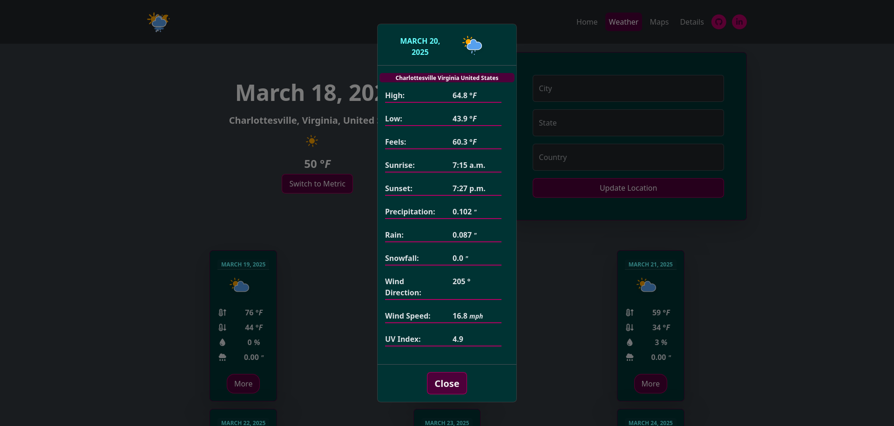

# 🌦️ Weather Forecast Web App  

A **Django-based weather forecast web application** that provides **real-time weather updates** and **7-day forecasts** for any location. Users can enter a **city, state, and country**, and the app fetches accurate weather data, including **temperature, precipitation, wind speed, UV index, and more**.  

## 🚀 Features  

✔ **Real-time Weather Data** – Displays the current temperature, precipitation, and other conditions.  
✔ **7-Day Forecast** – Get a detailed outlook for the next week.  
✔ **Dynamic Weather Icons** – Animated SVG icons change based on the weather.  
✔ **Sunrise & Sunset Times** – Accurate calculations based on location.  
✔ **Location Search** – Enter any city, state, and country to fetch local weather.  
✔ **Geocoding API** – Converts location names into latitude/longitude.  
✔ **Open-Meteo API** – Fetches live weather data.  
✔ **All APIs Are 100% Free** – All APIs used in this project are completely free.


## 🛠️ Technologies Used  

- **Django** – Backend framework  
- **Celery + Redis** – Background task processing  
- **Geocoding API** – Converts city names to coordinates  
- **Open-Meteo API** – Retrieves weather data  
- **Bootstrap + FontAwesome** – Responsive UI & icons  

## 🔧 Setup Instructions  

1. Clone the repo:

    ```bash
    git clone https://github.com/Alexander-N-Shelton/weather-app.git
    cd weather-app
    ```

2. Create a virtual environment & install dependencies:

    ```bash
    python -m venv .venv
    source .venv/bin/activate # Linux
    source .venv/Scripts/activate # Windows
    pip install -r requirements.txt
    ```

3. Set up environment variables:

    - Create a `.env` file in the project root and add:

    ```ini
    SECRET_KEY=your-django-secret-key
    GEOCODE_API_KEY=your-google-api-key
    ```

### Don't have a Geocoding API Key❓

Visit [Geocode.Maps.Co](https://geocode.maps.co/) to get one for free.

4. Run migrations and start the server:

    ```bash
    python manage.py makemigrations
    python manage.py migrate
    python manage.py runserver
    ```

⚠️ **WARNING**: If you're using an API that is not free be careful when running automatic API requests.

5. Start Celery (optional for automatic weather updates)

    ```bash
    celery -A your_project_name worker --loglevel=info
    ```

### Modals with detailed info of each day's forecast



### Displays dynamically on small screens


### Full-screen modals for display on small screens


---

## Credits

- Credit for the amazing animated icons:
[Makin-Things](https://github.com/Makin-Things/weather-icons)

### Thank you to all these incredible websites for providing free APIs ❤️

- <https://open-meteo.com/>
- <https://geocode.maps.co/>
- <https://sunrise-sunset.org/api>
