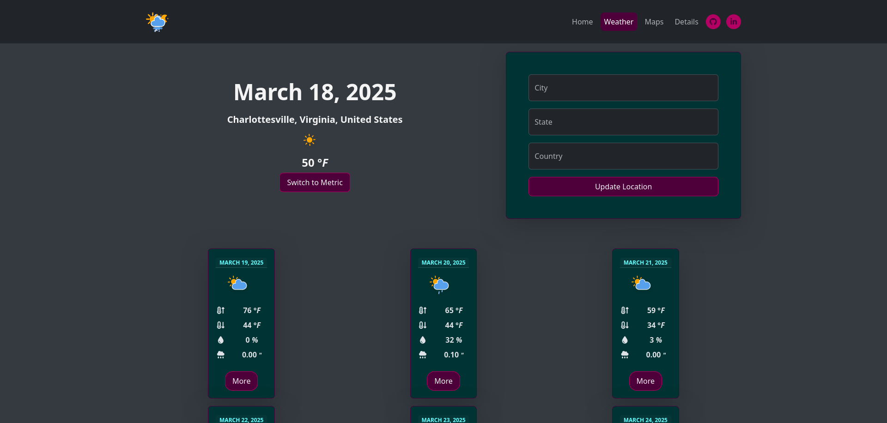
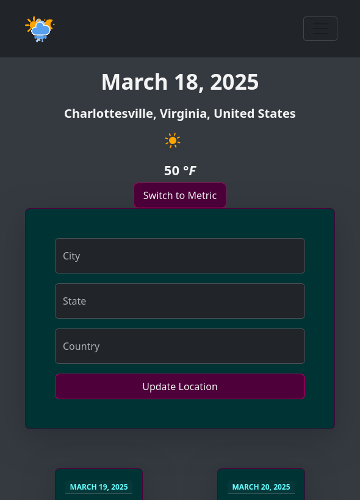

# 🌦️ Weather Forecast Web App  

A **Django-based weather forecast web application** that provides **real-time weather updates** and **7-day forecasts** for any location. Users can enter a **city, state, and country**, and the app fetches accurate weather data, including **temperature, precipitation, wind speed, UV index, and more**.  

## Come Check It Out ‼️

[DjangoWeatherApp](https://djangoweatherwebapp.pythonanywhere.com/)

## 🚀 Features  

✔ **Real-time Weather Data** – Displays the current temperature, precipitation, and other conditions.  
✔ **7-Day Forecast** – Get a detailed outlook for the next week.  
✔ **Dynamic Weather Icons** – Animated SVG icons change based on the weather.  
✔ **Sunrise & Sunset Times** – Accurate calculations based on location.  
✔ **Location Search** – Enter any city, state, and country to fetch local weather.  
✔ **Geocoding API** – Converts location names into latitude/longitude.  
✔ **Open-Meteo API** – Fetches live weather data.  
✔ **All APIs Are 100% Free** – All APIs used in this project are completely free.



## 🛠️ Technologies Used  

- **Django** – Backend framework  
- **Cron** – Background task processing  
- **Geocoding API** – Converts city names to coordinates  
- **Open-Meteo API** – Retrieves weather data  
- **Bootstrap + FontAwesome** – Responsive UI & icons  

## 🔧 Setup Instructions  

### 1. Clone the repo

```bash
git clone https://github.com/Alexander-N-Shelton/weather-app.git
cd weather-app
```

### 2. Create a virtual environment & install dependencies

```bash
python -m venv .venv
source .venv/bin/activate # Linux
source .venv/Scripts/activate # Windows
pip install -r requirements.txt
```

### 3. Set up environment variables

- Create a `.env` file in the project root and add:

```ini
SECRET_KEY=your-django-secret-key
GEOCODE_API_KEY=your-google-api-key
```

### Don't have a Geocoding API Key❓

Visit [Geocode.Maps.Co](https://geocode.maps.co/) to get one for free.

### 4. Run migrations and start then load the database

```bash
python manage.py makemigrations
python manage.py migrate
python manage.py shell
>>> from weather.tasks import update_weather, LATITUDE, LONGITUDE
>>> update_weather(LATITUDE, LONGITUDE)
>>> exit()
```

### 5. Start the server

```bash
python manage.py runserver
```

⚠️ **WARNING**: If you're using an API that is not free be careful when running automatic API requests.

### 6. Start cron job (optional for automatic weather updates)

To automatically update the weather every 15 minutes, add the following to your crontab.

#### 1. Open the crontab editor

```bash
crontab -e
```

#### 2. Add this line (adjusting the path as neccessary)

```bash
*/15 * * * * /usr/bin/python /home/user/djangoWeatherApp/manage.py update_weather
```

#### 3. Save and exit

#### 4. Restart cron

```bash
sudo service cron restart 
```

---

## Note: Navbar is just a placeholder for now

### Modals with detailed info of each day's forecast


### Displays dynamically on small screens



---

## Credits

- Credit for the amazing animated icons:
[Makin-Things](https://github.com/Makin-Things/weather-icons)

### Thank you to all these incredible websites for providing free APIs and great documentation. ❤️

- <https://open-meteo.com/>
- <https://geocode.maps.co/>
- <https://sunrise-sunset.org/api>
